# Atmosphere - Modern Weather Application

A premium, production-ready Weather Application built with **Django** (Backend) and **Vanilla HTML/CSS/JS** (Frontend). This project features a smart caching system, dynamic background aesthetics, and a robust authentication flow.

---

## 🚀 Technical Stack
*   **Backend:** Django 5, Django REST Framework (DRF)
*   **Database:** SQLite (Dev) -> Portable to PostgreSQL
*   **Frontend:** HTML5, CSS3 (Glassmorphism), Vanilla JavaScript (ES6+)
*   **External API:** OpenWeatherMap

---

## 🛠 Backend Implementation
The backend is structured into modular apps (`api`, `authorization`) to ensure scalability and clean code separation.

### 1. **Architecture & Design Patterns**
*   **Services Layer (`api/services.py`):** Business logic is decoupled from Views.
    *   `WeatherService` handles the core logic: Check DB -> Fetch API -> Save to DB.
    *   **Data Normalization:** All inputs (City, State, Country) are stripped and capitalized/canonicalized before storage to prevent duplicates (e.g., "London" vs "london").
*   **Smart Caching Strategy (`api/models.py`):**
    *   **`WeatherCache` Model:** Stores the full JSON payload from the external API to minimize redundant requests.
    *   **Custom Manager (`WeatherCacheManager`):** Efficiently queries for valid (non-expired) data based on a configurable time threshold (default: 60 mins).
    *   **Search History:** A separate model tracks user-specific searches without duplicating the heavy JSON data (Normalizes relational data).

### 2. **Authentication & Authorization**
*   **JWT Implementation:** Uses Access and Refresh tokens for secure, stateless authentication.
*   **Dedicated App (`authorization`):** Separates Auth logic (Register, Login, Logout) from the core Weather API.
*   **Custom User Model:** Extends `AbstractUser` to support Email/Phone as primary identifiers if needed.

### 3. **Security & Performance**
*   **Throttling (`api/throttles.py`):**
    *   **`WeatherAnonThrottle`:** Limits unauthenticated users to prevent abuse (`weather_limited` scope).
    *   **`WeatherUserThrottle`:** Higher limits for logged-in users (`weather_burst` scope).
*   **Environment Variables:** Sensitive keys (API_KEY, SECRET_KEY) are managed via `.env`.

### 4. **Request Flow Diagram**
Below is the architectural flow of a single Weather Request, illustrating the interaction between the Frontend, Django Backend, Database Cache, and External API.

```mermaid
sequenceDiagram
    participant U as User/Frontend
    participant M as Middleware (Auth/Exception)
    participant V as Django View
    participant S as WeatherService
    participant DB as Database (Cache)
    participant EXT as OpenWeatherMap API

    Note over U, EXT: User Requests Weather Data (City, State, Country)

    U->>M: GET /api/weather/?city=...
    
    rect rgb(30, 30, 30)
        Note right of M: Security Checks
        M->>M: Check Rate Limits (Throttle)
        M->>M: Verify JWT Token (if auth)
    end
    
    M->>V: Pass Valid Request
    V->>S: Fetch Weather (City, State, Country)
    
    S->>S: Normalize Input (UpperCase)
    
    S->>DB: Check Valid Cache ?
    alt Cache Hit (Data Exists & Fresh)
        DB-->>S: Return Cached JSON
        S-->>V: Return Data
        V-->>U: HTTP 200 OK (JSON)
    else Cache Miss (No Data or Expired)
        S->>EXT: GET /data/2.5/weather
        
        alt External API Error
            EXT-->>S: 404/500 Error
            S-->>V: Raise Exception
            V-->>M: Handle Exception (Graceful JSON)
            M-->>U: HTTP 400/503 Error
        else Success
            EXT-->>S: JSON Weather Data
            S->>DB: Save/Update Cache (Canonical Name)
            S-->>V: Return Data
            V-->>U: HTTP 200 OK (JSON)
        end
    end
```



---

## 🎨 Frontend Implementation
The frontend is built without heavy frameworks to ensure maximum performance, relying on modern native browser capabilities.

### 1. **User Experience (UX)**
*   **Chat-Interface Logic:** Instead of a complex form, the user interacts with a step-by-step "Chat" flow:
    1.  User enters **City** -> Hit Enter.
    2.  User enters **State** (optional).
    3.  User enters **Country** -> Fetches Data.
*   **State Management (`sessionStorage`):** The app remembers the last searched city/result, so refreshing the page restores the exact state without re-fetching.

### 2. **Visual Aesthetics**
*   **Dynamic Background System:**
    *   **Default State:** Loads a premium `space.jpg` background for Login, Register, and Homepage.
    *   **Weather-Responsive:** Background changes dynamically based on the API response (e.g., `Clear` -> Sunny GIF, `Rain` -> Rainy GIF).
    *   **Update Logic:** A centralized `updateBackground()` function maps weather conditions (case-insensitive) to specific Giphy URLs or local assets.
*   **Glassmorphism:** CSS variables (`--glass-bg`, `--glass-border`) create a consistent, frosted-glass effect across all components (Navbar, Cards, Inputs).
*   **CSS Animations:**
    *   `@keyframes` used for smooth entry animations (`fade-in`, `slide-down`).
    *   Mobile-responsive adjustments ensure the UI remains broken-grid free on smaller screens.

### 3. **JavaScript Architecture (`app.js` & `auth.js`)**
*   **Modular Object-Based Design:** Code is organized into `App` and `Auth` objects (`App.init()`, `App.bindEvents()`).
*   **Auth Interceptor:** The `Auth.request()` wrapper automatically attaches the JWT Access token to requests.
    *   **Auto-Refresh:** If a 401 error occurs, it attempts to use the Refresh token to get a new Access token and retries the original request seamlessly.
    *   **Universal Logout:** If refresh fails, the user is redirected to Login.

---

## 📁 Directory Structure Overview
```text
Root
├── Backend/
│   ├── api/            # Core Weather Logic (Models, Views, Services)
│   ├── authorization/  # Auth Logic (Login, Register)
│   └── core/           # Project Settings
├── Frontend/
│   ├── assets/         # Images & Static resources
│   ├── css/            # style.css, auth.css
│   ├── js/             # app.js (Main), auth.js (Token handling)
│   └── *.html          # Pages
└── readme.md           # This documentation
```
